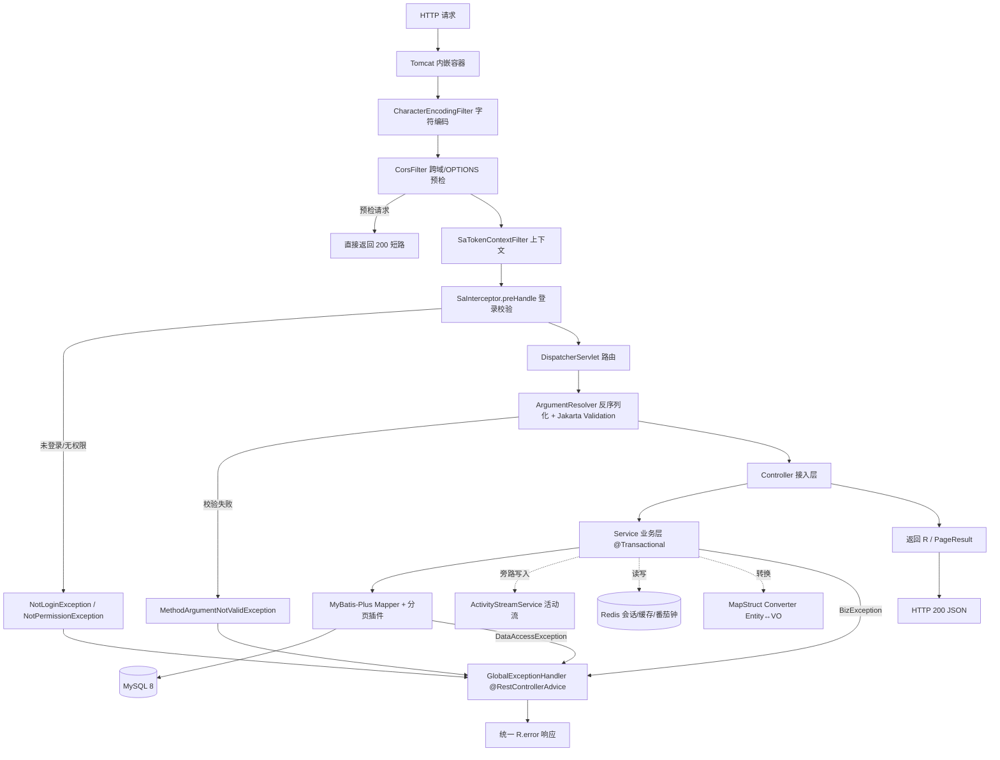
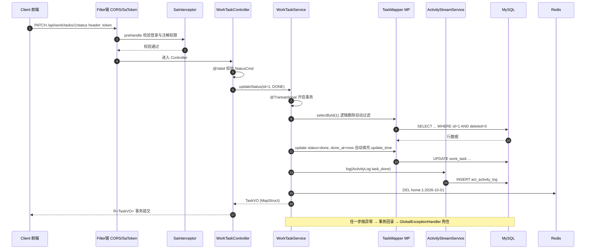
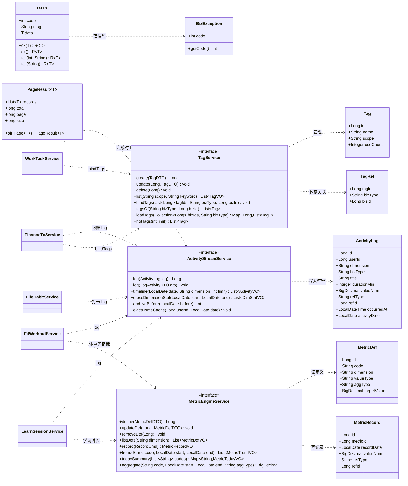

# Personal OS · 后端架构设计

> 归属：Personal OS 个人操作系统 · 后端（personal-os-server）
> 技术栈（已拍板，不可替换）：JDK 17 · Spring Boot 3.2.x · MyBatis-Plus 3.5.x · MySQL 8 · Redis · Sa-Token 1.46.0 · Flyway · Knife4j 4.x · Hutool · MapStruct
> 形态：单模块分包，不搞 Maven 多模块
> 版本：v1.0 · 2026-10-01 · 对应《personal-os-design.md》第 3 / 5 / 6 节
> 目标读者：工程师（寇豆码）——本文写到「可照此开工」的深度，但不含业务代码实现

---

## 0. 阅读指引

| 章节 | 回答的问题 |
|---|---|
| 1 请求全链路 | 一个 HTTP 请求进来，到底经过了哪些组件、每步做什么、异常在哪兜住 |
| 2 分层职责边界 | Controller / Service / Mapper 各自的红线 |
| 3 三大通用引擎 | 指标 / 活动流 / 标签引擎的 Java 级接口与调用方式 |
| 4 横切关注点 | 统一响应、异常、校验、鉴权、AOP、事务、自动填充、缓存、操作日志 |
| 5 配置管理 | application.yml 怎么拆、各组件关键配置项 |
| 6 依赖清单 | pom.xml 具体坐标 + 版本 + 用途 |
| 7 代码约定 | 包结构、命名、DTO/VO/Entity 转换、分页、逻辑删除、PeriodUtil 口径 |
| 8 定时任务 | 日汇总 / 周报 / streak / 归档的触发与幂等 |
| 9 P0 文件清单与顺序 | 可直接派工的实现顺序与依赖关系 |

贯穿全篇的一条主线：**各业务域（work/learn/fit/finance/life）只写自己的强语义逻辑，量化追踪、时间轴、标签全部下沉到 system 域的三大通用引擎。**

---

## 0.5 落地修订记录（P0 实施后，2026-10-01 · RIce）

> P0 登录闭环已实施。以下为**实际落地与本文原稿的偏差**，遇到冲突时**以本节为准**。原因分两类：本机环境约束（JDK 24）、QA 修复。

| # | 项 | 原稿 | 实际落地 | 原因 |
|---|---|---|---|---|
| 1 | Spring Boot | 3.2.5 | **3.5.16** | 本机仅有 JDK 24（无 17/21），Boot 3.2.x 不支持 |
| 2 | MyBatis-Plus | 3.5.7 | **3.5.17** + 显式补 `mybatis-plus-jsqlparser` | 版本对齐；3.5.9+ 把 JSqlParser 拆出 starter |
| 3 | Hutool | 5.8.27 | 5.8.47 | 随 Boot 3.5 上调 |
| 4 | MapStruct | 引入 | **不引入** | JDK 24 注解处理器风险大 + P0 用不上；转换用 Hutool BeanUtil / 手写 |
| 5 | Knife4j | 4.5.0 | 保留，但**显式锁 `springdoc-openapi-starter-webmvc-ui:2.8.6`** | Knife4j 传递的 springdoc 低于 Boot 3.5 要求 |
| 6 | Sa-Token 会话 | Redis（sa-token-redis-jackson） | **内存会话**（P1 已定继续不引 Redis） | 本机无 Redis；番茄钟推 P2 时再定 |
| 7 | 编译 | JDK 17 | `maven.compiler.release=17`，**JDK 24 编译器**；`annotationProcessorPaths` 显式挂 Lombok + `-proc:full` | JDK 23+ javac 不再自动跑 classpath 注解处理器 |
| 8 | Flyway 范围 | V1–V4 | P0 仅 **V1__init_sys_user.sql**；V2–V4（引擎表）推迟到 P1 M0 | P0 只做登录 |
| 9 | 种子账号 | — | `DataInitializer`（ApplicationRunner，表空播种，BCrypt 现算），**不进 Flyway** | 迁移与数据分离 |
| 10 | CORS | — | **显式白名单** `personal-os.cors.allowed-origins` + `setAllowedOrigins` | QA 实测 `addAllowedOriginPattern("*")` + credentials 会回显任意 Origin，安全漏洞已修 |
| 11 | 错误码扩展 | ErrorCode 统一枚举 | ErrorCode 保持枚举；**模块错误码用各自包内枚举 + `BizException(int, String)`**（P1 并行约定，见 dev-workflow.md） | 零侵入，避免多窗口改共享文件 |
| 12 | §4.8 首页 Redis 缓存 | Cache-Aside + TTL | **未实施**（无 Redis），首页聚合暂直查 DB | P1 数据量小，直查够用；引入 Redis 时补 |
| 13 | §8 定时任务 | P0 末尾实现 | **推迟**（P1 不做，原稿本就建议延后） | — |
| 14 | 畸形 JSON | — | `GlobalExceptionHandler` 补 `HttpMessageNotReadableException` → 400 | QA 第 1 轮抓出 |

P1 补充约定（2026-10-01 小杜拍板）：时间口径**自然日 00:00**（PeriodUtil 唯一来源）；任务逾期**只标记不顺延**。

---

## 1. 请求全链路

### 1.1 组件流水线

请求自左向右穿过，任一环节抛异常统一由最右侧的 `GlobalExceptionHandler` 兜住。

| # | 组件 | 层 | 职责 | 失败时 |
|---|---|---|---|---|
| 1 | Tomcat（内嵌） | 容器 | 连接、线程池、HTTP 解析 | 容器级 4xx/5xx |
| 2 | `CharacterEncodingFilter` | Filter | 统一 UTF-8（Boot 自动装配） | — |
| 3 | `CorsFilter` | Filter | 跨域放行、OPTIONS 预检直接短路返回 | 预检不合法拒绝 |
| 4 | `SaTokenContextFilter`（sa-token 提供） | Filter | 建立 Sa-Token 上下文、读取 token | — |
| 5 | `SaInterceptor` | Interceptor | `preHandle` 执行登录校验（含注解式 `@SaCheckLogin` 等） | 抛 `NotLoginException` |
| 6 | `DispatcherServlet` | MVC 核心 | 路由到 HandlerMethod | 404 `NoHandlerFoundException` |
| 7 | `HandlerMethodArgumentResolver` | MVC | 反序列化 `@RequestBody` + 触发 Jakarta Validation | 抛 `MethodArgumentNotValidException` |
| 8 | **Controller** | 接入层 | 参数绑定、调 Service、返回 `R<T>`／`PageResult<T>` | 不 catch，向上抛 |
| 9 | **Service** | 业务层 | 业务规则、事务边界、编排通用引擎 | 抛 `BizException` |
| 10 | **Mapper（MyBatis-Plus）** | 持久层 | CRUD + 分页插件 + 逻辑删除 + 自动填充 | 包装为 `DataAccessException` |
| 11 | MySQL 8 | 存储 | InnoDB / utf8mb4 | — |
| 12 | Redis | 旁路 | 会话、首页统计缓存、番茄钟状态、热点标签 | 降级为直查 DB |

### 1.2 请求全链路流程图



### 1.3 典型写请求时序（任务状态流转为例）



---

## 2. 分层职责边界（红线）

**铁律三句**：Controller 不碰 Entity；Service 是唯一事务边界；Mapper 只做数据访问，不含业务判断。

| 层 | 该做（Do） | 不做（Don't = 红线） |
|---|---|---|
| **Controller** | 参数绑定、`@Valid` 触发校验、调用 Service、把结果包成 `R`/`PageResult`、Swagger 注解 | ❌ 写业务逻辑 ❌ 出现 `Entity`（只能收 `XxxDTO/Query`、返 `XxxVO`） ❌ `try/catch` 业务异常 ❌ 直接注入 Mapper ❌ 开事务 |
| **Service** | 业务规则、编排多个 Mapper 与三大引擎、DTO↔Entity 转换调用、声明 `@Transactional`、抛 `BizException` | ❌ 出现 HttpServletRequest/Response ❌ 返回 `R`（返回 VO/领域对象） ❌ 内联复杂 SQL（下沉 Mapper） |
| **Mapper** | 单表/多表 SQL、MP `BaseMapper` CRUD、分页、`@Select`/XML 复杂查询 | ❌ 含业务分支/权限判断 ❌ 开事务 ❌ 调用其它 Service ❌ 返回 VO（返回 Entity 或投影 DO） |
| **Entity** | 与表一一映射，字段+`@TableName/@TableField` | ❌ 加业务方法 ❌ 出现在 Controller/前端 |
| **Converter** | MapStruct 声明式转换 DTO→Entity、Entity→VO、List 批量 | ❌ 手写循环 `set`（除非字段差异大） |

**事务红线**：`@Transactional` 只能出现在 Service（或其内部私有方法的同层调用需注意自调用失效）。Controller、Mapper、Job 编排层不得直接开事务；跨域写入（业务表 + 活动流）必须在**同一个** Service 事务内保证一致性。

---

## 3. 三大通用引擎类设计

### 3.1 引擎与业务域的调用关系



### 3.2 引擎接口签名（Java 方法级）

**ActivityStreamService — 活动流引擎（旁路写入，全系统时间轴）**
```java
public interface ActivityStreamService {
    /** 写入一条活动流；内部补齐 userId/activityDate，事务内调用 */
    Long log(ActivityLog log);
    /** DTO 便捷入口（供 @LogActivity AOP 与快捷记录复用） */
    void log(LogActivityDTO dto);
    /** 当天时间轴（可过滤维度），倒序 */
    List<ActivityVO> timeline(LocalDate date, String dimension, int limit);
    /** 跨域统计：本周各维度时长/次数占比 */
    List<DimStatVO> crossDimensionStat(LocalDate start, LocalDate end);
    /** 归档 occurred/activityDate 早于 before 的记录到历史表，返回迁移行数 */
    int archiveBefore(LocalDate before);
    /** 失效首页统计缓存 */
    void evictHomeCache(Long userId, LocalDate date);
}
```

**MetricEngineService — 指标引擎（可配置量化追踪）**
```java
public interface MetricEngineService {
    Long define(MetricDefDTO dto);                       // 新增指标定义（=加一条 def，不改表不改码）
    void updateDef(Long id, MetricDefDTO dto);
    void removeDef(Long id);                             // 逻辑删除；有记录时拒绝或级联策略
    List<MetricDefVO> listDefs(String dimension);        // dimension 为空=全部

    MetricRecordVO record(RecordCmd cmd);                // 统一写入口：查 def→校验 value_type→落记录→触发 KR 重算
    List<MetricTrendVO> trend(String code, LocalDate start, LocalDate end);   // 按 def.aggType 聚合
    Map<String, MetricTodayVO> todaySummary(List<String> codes);              // 首页卡片批量取今日值
    BigDecimal aggregate(String code, LocalDate start, LocalDate end, String aggType); // sum/avg/max/min/last
}
// RecordCmd 字段：String code; LocalDate date; BigDecimal valueNum; String valueText;
//                String refType; Long refId; String remark;
```

**TagService — 标签引擎（多态关联）**
```java
public interface TagService {
    Long create(TagDTO dto);
    void update(Long id, TagDTO dto);
    void delete(Long id);
    List<TagVO> list(String scope, String keyword);

    void bindTags(List<Long> tagIds, String bizType, Long bizId);  // 覆盖式：先删后插，维护 use_count
    List<Tag> tagsOf(String bizType, Long bizId);
    Map<Long, List<Tag>> loadTags(Collection<Long> bizIds, String bizType); // 批量，防列表页 N+1
    List<Tag> hotTags(int limit);                                  // 读 Redis 热点，兜底查 DB
}
```
> `bizType` 取值走常量：`BizType` 枚举（`task / sop / note / workout / transaction / checkin / diary / project`）。
> 业务域调用范式：业务 Service 先落自己的强语义表拿到 `id`，再 `tagService.bindTags(...)` + `activityStreamService.log(...)`，三者同一事务。

### 3.3 AOP 埋点：`@LogActivity`

为降低业务侵入，提供注解 + 切面自动写活动流（与手动 `log()` 二选一）。

```java
@Target(ElementType.METHOD) @Retention(RetentionPolicy.RUNTIME)
public @interface LogActivity {
    String dimension();                 // WORK/LEARN/FIT/FINANCE/LIFE
    String bizType();                   // task_done / workout / expense ...
    String titleSpEL() default "";      // 如 "#result.title"
    String refIdSpEL()   default "";    // 如 "#result.id"
    String durationSpEL() default "";   // 如 "#cmd.costMinutes"
    boolean afterCommit() default true; // 默认事务提交后再写，避免回滚污染活动流
}
```
切面 `ActivityLogAspect`：`@Around` 解析 SpEL 组装 `ActivityLog`，`afterCommit=true` 时注册 `TransactionSynchronization` 在提交后写入。**注意**：活动流若允许"最终一致"，提交后写；若要求强一致（首页立即可见），改事务内写并接受回滚。

---

## 4. 横切关注点

### 4.1 统一响应体

```java
// 成功：{"code":0,"msg":"ok","data":{...}}
// 失败：{"code":10001,"msg":"指标不存在","data":null}
@Data
public class R<T> {
    private int code;
    private String msg;
    private T data;
    public static <T> R<T> ok(T data);
    public static <T> R<T> ok();
    public static <T> R<T> fail(int code, String msg);
    public static <T> R<T> fail(String msg);
}

@Data
public class PageResult<T> {
    private List<T> records;
    private long total;
    private long page;   // 从 1 开始
    private long size;
    public static <T> PageResult<T> of(IPage<T> p);
}
```
**是否用 `ResponseBodyAdvice` 自动包装？** 建议**不用**自动包装，Controller 显式返回 `R.ok(...)`，理由是 Knife4j 与前端类型更直观、避免对 String/文件下载接口误包。若要自动包装，需排除 `Knife4j` 文档端点与文件流。

### 4.2 异常编码规范与全局处理

**编码分段**（`ErrorCode` 枚举，`code` 与 HTTP 语义对齐 + 业务段）：

| 段位 | 范围 | 含义 | 示例 |
|---|---|---|---|
| 0 | 0 | 成功 | — |
| 通用 | 400 / 401 / 403 / 404 / 500 | 参数/未登录/无权限/不存在/服务端 | `PARAM_ERROR(400)` |
| 业务通用 | 1000-1099 | 通用业务失败 | `BIZ_ERROR(1000)` |
| work | 10000-10999 | 工作域 | `SOP_NOT_FOUND(10001)` |
| learn | 11000-11999 | 学习域 | `NOTE_REVIEW_CONFLICT(11001)` |
| fit | 12000-12999 | 运动域 | `WORKOUT_TYPE_INVALID(12001)` |
| finance | 13000-13999 | 理财域 | `AMOUNT_ILLEGAL(13001)` |
| life | 14000-14999 | 生活域 | `HABIT_ALREADY_CHECKED(14001)` |
| system | 15000-15999 | 系统/引擎 | `METRIC_DEF_DUP_CODE(15001)` |

```java
// 业务异常（Service 层统一抛）
public class BizException extends RuntimeException {
    private final int code;
    public BizException(ErrorCode ec, Object... args) { this.code = ec.getCode(); ... }
    public BizException(ErrorCode ec, String msg) { ... }
}

@RestControllerAdvice
public class GlobalExceptionHandler {
    @ExceptionHandler(BizException.class)          // 业务异常 → 原样 code/msg
    @ExceptionHandler(MethodArgumentNotValidException.class)  // 400 + 首个字段错误
    @ExceptionHandler(BindException.class)
    @ExceptionHandler(ConstraintViolationException.class)    // @Validated 参数级
    @ExceptionHandler(NotLoginException.class)     // 401，清 session
    @ExceptionHandler(NotPermissionException.class) // 403
    @ExceptionHandler(DataAccessException.class)   // 500，记录 SQL 摘要，不泄露给前端
    @ExceptionHandler(Exception.class)             // 兜底 500
}
```
规范：**Service 只抛 `BizException`，禁止 `throw new RuntimeException("中文串")`**；前端按 `code` 分支，`code!=0` 即弹 `msg`；`msg` 面向用户可读，技术细节只进日志。

### 4.3 参数校验（Jakarta Validation）

- 请求体：DTO 上加 `@NotNull/@NotBlank/@Size/@Min/@Max/@DecimalMin`，Controller 方法参数加 `@Valid`（或类级 `@Validated`）。
- 查询参数/路径变量：Controller 类加 `@Validated`，参数上 `@Min(1) @RequestParam`。
- 分组校验：`Create` / `Update` 两个 `interface` 分组，用 `@Validated(Create.class)`。
- 分页参数统一 `PageQuery{ Integer page=1; Integer size=20; }`，`size` 上限 200（`@Max(200)`）。
- 失败信息用 `MessageSource` + `ValidationMessages.properties`（中文），示例：`@NotBlank(message="{task.title.required}")`。

### 4.4 Sa-Token 鉴权

采用**拦截器（全局登录校验）+ 注解（细粒度权限）**双保险。

```java
// SaTokenConfig
@Configuration
public class SaTokenConfig implements WebMvcConfigurer {
    @Override
    public void addInterceptors(InterceptorRegistry registry) {
        registry.addInterceptor(new SaInterceptor(handle -> StpUtil.checkLogin()))
                .addPathPatterns("/api/**")
                .excludePathPatterns("/api/auth/login", "/api/auth/captcha",
                        "/doc.html", "/webjars/**", "/v3/api-docs/**", "/swagger-ui/**");
    }
}
```
- 登录：`/api/auth/login` → 校验 BCrypt → `StpUtil.login(userId)` → 返回 token。
- token 传输：Header `token: xxx`（Sa-Token 默认名，与设计稿一致），配置 `sa-token.token-name: token`。
- 会话持久化：`sa-token-redis-jackson`，重启不掉线、多实例共享。
- 注解式：`@SaCheckLogin`（登录）、`@SaCheckPermission("work:sop:edit")`（预留，个人系统可弱化）、`@SaIgnore`（放行）。
- 单用户体系：`StpUtil.getLoginIdAsLong()` 取 `userId`，所有查询强制带 `user_id`（见 4.5 数据隔离）。

**数据隔离约定**：因是单用户自托管，`userId` 恒为 1，但所有业务表仍保留 `user_id` 且查询强制拼入，为未来多用户/分享留位。

### 4.5 AOP 活动流埋点 + 操作日志

| 关注点 | 实现 | 落点 |
|---|---|---|
| 活动流（业务事件） | `@LogActivity` + `ActivityLogAspect` | `act_activity_log` |
| 操作日志（审计） | `@OperLog` + `OperLogAspect`（记录 method/uri/参数摘要/IP/耗时/结果） | `sys_oper_log`（需 Flyway 增表，P0 可选，P1 补） |

两者切面分离，避免职责混淆：活动流是**业务语义**（用户可见的时间轴），操作日志是**技术审计**（排障用）。

### 4.6 事务传播

- Service 公共方法默认 `@Transactional(rollbackFor = Exception.class)`（务必显式 `rollbackFor`，否则受检异常不回滚）。
- 只读查询：`@Transactional(readOnly = true)`。
- 跨 Service 调用：内层用默认 `REQUIRED` 复用外层事务；仅日志/统计类可选 `REQUIRES_NEW`（注意连接占用）。
- 活动流提交后写入：由 `@LogActivity(afterCommit=true)` 通过事务同步器实现。
- **禁止**在循环内开事务（`Mapper` 批量用 `saveBatch`）。

### 4.7 MyBatis-Plus 自动填充 + 逻辑删除

```java
@Component
public class MyMetaObjectHandler implements MetaObjectHandler {
    // insertFill: create_time / update_time = now(); deleted = 0
    // updateFill: update_time = now()
}
```
- 实体字段：`@TableField(fill = FieldFill.INSERT) LocalDateTime createTime;`、`@TableField(fill = FieldFill.INSERT_UPDATE) LocalDateTime updateTime;`
- 逻辑删除：实体的 `deleted` 加 `@TableLogic`；全局配置 `logic-delete-field: deleted, value: 1, delval: 0`（MP 3.5 写法：`logic-not-delete-value: 0 / logic-delete-value: 1`）。
- 注意：`act_activity_log`、`work_sop_step`、`*_item` 等**无 `deleted` 字段**的表不做逻辑删除；引擎表按各自 DDL 决定。

### 4.8 首页统计的 Redis 缓存与失效

| 项 | 约定 |
|---|---|
| Key | `home:{userId}:{yyyy-MM-dd}`（当天聚合），`home:radar:{userId}:{yyyy-MM}`（月度雷达） |
| Value | `HomeVO` 的 JSON（今日焦点+状态条+时间轴+指标卡） |
| TTL | 到当天 24:00（`Duration.between(now, LocalDate.now().plusDays(1).atStartOfDay())`） |
| 失效 | 任一写操作（打卡/记账/任务完成/指标写入）在**同事务提交后**调 `evictHomeCache(userId, today)`；由 `@LogActivity` 切面或 `HomeCacheEvictor` 统一触发，避免各域漏删 |
| 降级 | Redis 不可用时 `try/catch` 回源查 DB，不阻断主流程 |
| 番茄钟 | `pomodoro:{userId}` → 当前计时状态（start_at/minute/status），TTL=会话期；`/stop` 落 `life_pomodoro` 表并清 Key |
| 热点标签 | `tag:hot:{scope}` → Top N，`use_count` 变化时异步刷新，TTL 10min |

**缓存失效原则**：**先提交事务，再删缓存**（Cache-Aside），读路径 `先查缓存→miss 查 DB→回填`；不做 `update` 覆盖写（防并发脏写）。

### 4.9 参数/返回值序列化

- 全局 `Jackson`：`LocalDate`→`yyyy-MM-dd`，`LocalDateTime`→`yyyy-MM-dd HH:mm:ss`，`Long`/`BigDecimal` 保留精度（`BigDecimal` 用字符串输出防 JS 精度丢失）。
- 时区：统一 `Asia/Shanghai`（`spring.jackson.time-zone`），详见第 7 节日期口径。

---

## 5. 配置管理

### 5.1 文件拆分

```
src/main/resources/
├── application.yml          # 主配置：公共项 + profile 激活 + 各组件骨架
├── application-dev.yml      # 本地：MySQL/Redis 本机、show-sql、Flyway clean 谨慎
├── application-prod.yml     # 生产：Docker 内网地址、关闭 SQL 日志、连接池调优
└── mapper/                  # MyBatis XML（复杂 SQL）
```
激活：`application.yml` 内 `spring.profiles.active: ${PROFILE:dev}`；生产用环境变量 `-Dspring.profiles.active=prod` 注入，**敏感项（DB 密码、Redis 密码）一律用环境变量占位** `${DB_PASSWORD}`，不进 Git。

### 5.2 主配置 `application.yml` 关键项

```yaml
server:
  port: 8080
  servlet:
    context-path: /            # 基础路径 /api 由 Controller @RequestMapping 承担；或设此处
spring:
  application.name: personal-os-server
  profiles.active: ${PROFILE:dev}
  jackson:
    date-format: yyyy-MM-dd HH:mm:ss
    time-zone: Asia/Shanghai
    default-property-inclusion: non_null
  datasource:
    url: jdbc:mysql://${DB_HOST:127.0.0.1}:3306/personal_os?useUnicode=true&characterEncoding=utf8&serverTimezone=Asia/Shanghai&rewriteBatchedStatements=true
    username: ${DB_USER:root}
    password: ${DB_PASSWORD:root}
    driver-class-name: com.mysql.cj.jdbc.Driver
    hikari:
      maximum-pool-size: 10
      minimum-idle: 2
      connection-timeout: 30000
  data.redis:
    host: ${REDIS_HOST:127.0.0.1}
    port: 6379
    password: ${REDIS_PASSWORD:}
    database: 0
    lettuce.pool: { max-active: 16, max-idle: 8, min-idle: 0 }
  flyway:
    enabled: true
    locations: classpath:db/migration
    baseline-on-migrate: true          # 首次接入已有库时
    validate-on-migrate: true
    encoding: UTF-8
    out-of-order: false

# MyBatis-Plus
mybatis-plus:
  mapper-locations: classpath*:/mapper/**/*.xml
  type-aliases-package: com.yourname.personalos.**.entity
  configuration:
    map-underscore-to-camel-case: true
    log-impl: org.apache.ibatis.logging.slf4j.Slf4jImpl
  global-config:
    banner: false
    db-config:
      id-type: auto
      logic-delete-field: deleted
      logic-delete-value: 1
      logic-not-delete-value: 0

# Sa-Token
sa-token:
  token-name: token
  timeout: 2592000            # 30 天
  active-timeout: -1
  is-concurrent: true
  is-share: false
  token-style: uuid
  is-log: false
  token-session-check-login: true

# Knife4j
knife4j:
  enable: true
  setting: { language: zh_cn }
springdoc:
  api-docs.enabled: true
  swagger-ui.path: /swagger-ui.html

# 自定义
personal-os:
  export-dir: ${EXPORT_DIR:./data/export}
  upload-dir: ${UPLOAD_DIR:./data/upload}
```

### 5.3 profile 差异

| 项 | dev | prod |
|---|---|---|
| `mybatis-plus.configuration.log-impl` | `StdOutImpl` | `Slf4jImpl` |
| 连接池 | max 5 | max 10，`keepalive-time` |
| Flyway | `clean-disabled: true` | `clean-disabled: true`（生产永不 clean） |
| Knife4j | 开启 | 开启但加登录保护或内网限定 |
| 日志 | `DEBUG` | `INFO`，写 `./logs` 滚动文件 |
| 敏感值 | 明文可 | 全部走环境变量 |

---

## 6. 依赖清单（pom.xml）

`parent` 用 Spring Boot BOM，MyBatis-Plus / Sa-Token / Knife4j / Hutool / MapStruct 需显式版本。

```xml
<parent>
  <groupId>org.springframework.boot</groupId>
  <artifactId>spring-boot-starter-parent</artifactId>
  <version>3.2.5</version>
  <relativePath/>
</parent>

<properties>
  <java.version>17</java.version>
  <mybatis-plus.version>3.5.7</mybatis-plus.version>
  <sa-token.version>1.46.0</sa-token.version>
  <knife4j.version>4.5.0</knife4j.version>
  <hutool.version>5.8.27</hutool.version>
  <mapstruct.version>1.5.5.Final</mapstruct.version>
</properties>
```

| 依赖坐标 | 版本 | 用途 |
|---|---|---|
| `spring-boot-starter-web` | BOM 3.2.5 | Web MVC + 内嵌 Tomcat + Jackson |
| `spring-boot-starter-validation` | BOM | Jakarta Validation（Hibernate Validator） |
| `spring-boot-starter-data-redis` | BOM | Redis 客户端（Lettuce） |
| `spring-boot-starter-aop` | BOM | `@LogActivity` / `@OperLog` 切面 |
| `com.baomidou:mybatis-plus-spring-boot3-starter` | 3.5.7 | ORM、分页、逻辑删除、自动填充（**Boot 3 专用 starter**） |
| `com.mysql:mysql-connector-j` | BOM | MySQL 8 驱动 |
| `org.flywaydb:flyway-core` | BOM | DB 版本化迁移核心 |
| `org.flywaydb:flyway-mysql` | BOM | Flyway 对 MySQL 8 的方言支持（**必需**） |
| `cn.dev33:sa-token-spring-boot3-starter` | 1.46.0 | 鉴权（**Boot 3 专用 starter**） |
| `cn.dev33:sa-token-redis-jackson` | 1.46.0 | Sa-Token 会话落 Redis（Jackson 序列化） |
| `org.apache.commons:commons-pool2` | BOM | Lettuce 连接池（`lettuce.pool` 生效前提） |
| `com.github.xiaoymin:knife4j-openapi3-jakarta-spring-boot-starter` | 4.5.0 | 接口文档（基于 SpringDoc OpenAPI 3，Jakarta 命名空间） |
| `org.springframework.security:spring-security-crypto` | BOM | 仅用 BCryptPasswordEncoder（**不引入 spring-security 全家桶**） |
| `cn.hutool:hutool-all` | 5.8.27 | 日期/字符串/集合/IO 工具 |
| `org.mapstruct:mapstruct` | 1.5.5.Final | Entity↔VO/DTO 编译期代码生成 |
| `org.mapstruct:mapstruct-processor` | 1.5.5.Final | MapStruct 注解处理器（`provided`） |
| `org.projectlombok:lombok` | BOM | 样板代码（`provided`） |
| `spring-boot-configuration-processor` | BOM | 自定义配置项元数据（`optional`） |
| `spring-boot-devtools` | BOM | 热重启（`optional`，仅 dev） |
| `spring-boot-starter-test` | BOM | 单元测试（`test`） |

**构建插件**：`maven-compiler-plugin` 需配 `annotationProcessorPaths` 同时挂 `lombok` + `mapstruct-processor` + `lombok-mapstruct-binding`，否则 Lombok 生成的 getter 不被 MapStruct 识别。

```xml
<plugin>
  <groupId>org.apache.maven.plugins</groupId>
  <artifactId>maven-compiler-plugin</artifactId>
  <configuration>
    <annotationProcessorPaths>
      <path><groupId>org.projectlombok</groupId><artifactId>lombok</artifactId><version>${lombok.version}</version></path>
      <path><groupId>org.mapstruct</groupId><artifactId>mapstruct-processor</artifactId><version>${mapstruct.version}</version></path>
      <path><groupId>org.projectlombok</groupId><artifactId>lombok-mapstruct-binding</artifactId><version>0.2.0</version></path>
    </annotationProcessorPaths>
  </configuration>
</plugin>
```

**排除**：不引入 `spring-boot-starter-security`（与 Sa-Token 冲突且过重）；不引入 JPA。

---

## 7. 关键代码约定

### 7.1 包结构（单模块分包）

```
com.yourname.personalos/
├── PersonalOsApplication.java
├── common/
│   ├── result/       R / PageResult / PageQuery / ErrorCode
│   ├── exception/    BizException / GlobalExceptionHandler
│   ├── config/       MybatisPlusConfig / RedisConfig / SaTokenConfig
│   │                 WebMvcConfig / CorsConfig / Knife4jConfig / JacksonConfig
│   ├── constant/     DimensionEnum / BizTypeEnum / MetricCodeConst / CacheKeyConst
│   ├── util/         PeriodUtil / JsonUtil
│   ├── annotation/   @LogActivity / @OperLog
│   ├── aspect/       ActivityLogAspect / OperLogAspect
│   └── handler/      MyMetaObjectHandler / HomeCacheEvictor
├── system/           ★ 通用引擎域
│   ├── controller/   UserController / TagController / MetricController
│   │                 ActivityController / ReviewController / DashboardController
│   ├── service/      MetricEngineService / ActivityStreamService / TagService
│   │                 + impl/
│   ├── mapper/ entity/ dto/ vo/ convert/
├── work/             controller/service(impl)/mapper/entity/dto/vo/convert
├── learn/            （同上）
├── fit/              （同上）
├── finance/          （同上）
├── life/             （同上）
├── stats/
│   ├── service/      DashboardAggregateService / CrossDimensionStatService / WeeklyReportService
│   └── job/          DailySummaryJob / WeeklyReportJob / HabitStreakJob / ArchiveJob
└── infra/            storage/ (文件) mail/ (可选)
```

### 7.2 类命名

| 类型 | 后缀 | 示例 |
|---|---|---|
| 接入 | `XxxController` | `WorkTaskController` |
| 业务 | `XxxService` / `XxxServiceImpl` | `WorkTaskService` |
| 持久 | `XxxMapper`（继承 `BaseMapper<Xxx>`） | `WorkTaskMapper` |
| 表映射 | `Xxx`（无后缀，`@TableName`） | `WorkTask` |
| 入参 | `XxxDTO` / `XxxCmd` / `XxxQuery` | `TaskCreateDTO` |
| 出参 | `XxxVO` | `TaskVO` |
| 转换 | `XxxConverter`（MapStruct `@Mapper`） | `WorkTaskConverter` |
| 枚举 | `XxxEnum` | `DimensionEnum` |
| 定时 | `XxxJob` | `DailySummaryJob` |

### 7.3 DTO / VO / Entity 转换职责

| 对象 | 出现层 | 说明 |
|---|---|---|
| `DTO/Cmd/Query` | Controller→Service | 入参，带校验注解 |
| `Entity` | Service↔Mapper | 表映射，**绝不外泄** |
| `VO` | Service→Controller→前端 | 出参，含展示所需聚合字段（如 `TaskVO.tagNames`） |
| `Converter` | MapStruct `@Mapper(componentModel="spring")` | 放各域 `convert/` 包，注入到 Service |

转换流向：`Controller` 收 `DTO` → `Service` 内 `Converter.toEntity(dto)` → 持久化 → `Converter.toVO(entity)` → 返回。VO 里的跨域字段（标签、指标值）由 Service 额外装配（`tagService.loadTags(...)`、`metricEngineService.todaySummary(...)`）后再补进 VO。

### 7.4 分页约定

- 入参：`page`（默认 1）、`size`（默认 20，最大 200），继承 `PageQuery`。
- 实现：`Page<Entity> p = new Page<>(page, size); mapper.selectPage(p, wrapper);` → `PageResult.of(p)`。
- 返回：`PageResult<VO>`，`records/total/page/size`。
- 插件：`MybatisPlusConfig` 注册 `MybatisPlusInterceptor` + `PaginationInnerInterceptor(DbType.MYSQL)`。
- 列表页标签/指标一律**批量装配**（`loadTags`），禁止在循环里单条查（N+1）。

### 7.5 逻辑删除约定

- 所有带 `deleted` 字段的表：实体加 `@TableLogic`，删除走 `mapper.deleteById()`（MP 自动转 `UPDATE ... SET deleted=1`）。
- 查询自动追加 `deleted=0`，手写 XML 注意补 `AND deleted = 0`。
- 无 `deleted` 的表（引擎明细/关联/日志）为**物理删除**，符合语义（如 `sys_tag_rel` 覆盖式先删后插）。

### 7.6 日期与周期口径 —— `PeriodUtil`

所有周/月/季统计**唯一来源**，避免各处自算导致口径漂移。

```java
public final class PeriodUtil {
    private PeriodUtil() {}
    // ISO-8601：周一为一周首日，周 key 形如 "2026-W40"（周数补零到两位）
    public static String weekKey(LocalDate d);            // V1:2026-W40
    public static String currentWeekKey();
    public static String monthKey(LocalDate d);           // 2026-10
    public static String currentMonthKey();
    public static String quarterKey(LocalDate d);         // 2026-Q4
    public static String yearKey(LocalDate d);            // 2026
    public static LocalDate[] weekRange(LocalDate d);     // [周一, 周日]
    public static LocalDate[] monthRange(LocalDate d);    // [1 号, 月末]
    public static LocalDate[] quarterRange(LocalDate d);
    public static LocalDate today();
}
```

| 口径项 | 约定 |
|---|---|
| 一周起点 | **周一**（`WeekFields.ISO`） |
| 周 key | `yyyy-'W'ww`，如 `2026-W40`，周数 2 位补零 |
| 月 key | `yyyy-MM`，如 `2026-10`（与 `bill_month`、`snapshot_month` 一致） |
| 季 key | `yyyy-'Q'q`，如 `2026-Q4` |
| 时区 | 服务端统一 `Asia/Shanghai`，日期字段用 `LocalDate`，时间戳用 `LocalDateTime` |
| 传输 | `LocalDate`→`yyyy-MM-dd`，`LocalDateTime`→`yyyy-MM-dd HH:mm:ss` |

`sys_review.period_key`、`life_goal.period_key`、`fin_transaction.bill_month`、`fin_asset_snapshot.snapshot_month` 全部复用上述格式。

---

## 8. 定时任务设计

统一基于 Spring `@Scheduled`（个人系统无需 XXL-Job），集中配置 `@EnableScheduling`，cron 写 `application.yml` 便于调整。

| Job | 触发时机 | 作用 | 幂等性设计 |
|---|---|---|---|
| `DailySummaryJob` | 每日 `23:55`（或次日 `00:05`） | 预生成当天汇总写 Redis `home:*`；可选落 `stat_daily` | 结果按 `(userId,date)` 覆盖写（`SET` 覆盖 + 到期 TTL），重跑无副作用 |
| `WeeklyReportJob` | 每周一 `02:00` 生成上一 ISO 周 | 聚合活动流+指标 → `sys_review.auto_data`（week） | `sys_review` 有 `uk_user_period`，用 `INSERT ... ON DUPLICATE KEY UPDATE auto_data`；**若该周已有 `good_text`（人工批注）则只刷新 `auto_data`，不覆盖批注** |
| `HabitStreakJob` | 每日 `00:30` | 全量重算 `life_habit.current_streak / best_streak / total_count` | **纯重算**：以 `life_habit_log` 为准重新推导，结果覆盖 → 天然幂等 |
| `ArchiveJob` | 每月 1 日 `03:00`，归档「上上个月」 | `act_activity_log` → `act_activity_log_{yyyyMM}` 历史表 | 按月份先 `EXISTS` 判断；单事务内 `INSERT INTO 历史表 SELECT ... WHERE activity_date∈区间` + `DELETE`；加「归档标记表」防重跑漏/重 |
| `MetricRollupJob`（P2 可选） | 每日 `00:10` | 长周期指标（周/月聚合）预计算 | 按 `(metric,period)` upsert |
| `ReminderJob`（P4） | 每日 `08:00` | 复习提醒/记账提醒/习惯将断提醒 | 每类提醒按 `(userId,date,type)` 去重，站内信/邮件 |

**通用约定**：
1. 所有 Job 的**业务写入包在单事务**内；跨表用事务保证一致。
2. Job 入口捕获异常并记录，**单次失败不中断调度**（Spring `@Scheduled` 默认单线程，建议配 `ThreadPoolTaskScheduler` 线程池并 `@Async` 隔离长任务）。
3. 生产多实例需加分布式锁（Redis `SETNX` 或 Sa-Token 锁）；单机部署可省，但代码预留 `RedisLockUtil` 入口。
4. 归档任务**先在事务内写入历史表再删除源表**，任一失败整体回滚，保证不丢数据。

---

## 9. P0 阶段后端文件清单与实现顺序

**实现顺序按依赖关系排列**，T01~T06 串行，其余可并行。文件路径相对 `personal-os-server/`。

| 任务 | 任务名 | 关键文件 | 依赖 | 优先级 |
|---|---|---|---|---|
| **T01** | 工程骨架 & 全局基座 | `pom.xml`、`PersonalOsApplication.java`、`application.yml/-dev/-prod`、`common/config/*`（MybatisPlus/Redis/SaToken/WebMvc/Cors/Knife4j/Jackson）、`common/result/R`、`PageResult`、`PageQuery`、`common/exception/BizException`、`GlobalExceptionHandler`、`ErrorCode`、`MyMetaObjectHandler` | — | P0 |
| **T02** | Flyway 迁移脚本 | `resources/db/migration/V1__init_system.sql`（sys_user/sys_tag/sys_tag_rel/sys_metric_def/sys_metric_record/act_activity_log/sys_review）、`V2__init_work.sql`、`V3__init_learn_fit.sql`、`V4__init_finance_life.sql` | T01 | P0 |
| **T03** | 认证闭环 | `system/controller/AuthController`、`system/service/UserService(+impl)`、`system/mapper/UserMapper`、`system/entity/SysUser`、`dto/LoginDTO`、`vo/LoginVO`、`common/util`（BCrypt 封装） | T01,T02 | P0 |
| **T04** | 三大通用引擎 | `system/service/{MetricEngineService,ActivityStreamService,TagService}(+impl)`、对应 `mapper/entity/dto/vo/convert`、`common/annotation/@LogActivity`、`common/aspect/ActivityLogAspect` | T01,T02 | P0 |
| **T05** | 引擎对外接口 | `system/controller/{TagController,MetricController,ActivityController}` | T04 | P0 |
| **T06** | 驾驶舱 V1 聚合 | `stats/service/DashboardAggregateService`、`system/controller/DashboardController`、`common/handler/HomeCacheEvictor`（首页缓存 + 失效钩子） | T04,T05 | P0 |
| **T07** | 定时任务基座 | `stats/job/{DailySummaryJob,WeeklyReportJob,HabitStreakJob,ArchiveJob}`（P0 先落 DailySummaryJob 空壳 + 归档 Job 骨架） | T06 | P1 |
| **T08** | 操作日志（审计） | `common/annotation/@OperLog`、`common/aspect/OperLogAspect`、`Flyway V5__add_oper_log.sql` | T01 | P1 |

**P0 验收线**：能登录 → 能通过 `/api/system/metrics` 新增一个自定义指标 → `/api/system/metrics/{code}/records` 写值 → 首页 `GET /api/dashboard/home` 能看到今日值与 7 日趋势。对应《设计稿》P0「能记、能看」的最小可用。

**建议并行拆包**（供多人/多轮迭代）：T01+T02（基座）→ T03（认证）与 T04（引擎）可并行 → T05+T06 → T07/T08。

---

## 10. 待与客户澄清的问题（阻塞性/影响设计）

| # | 问题 | 影响 |
|---|---|---|
| 1 | 是否严格单用户（`userId` 恒为 1）？还是预留多用户/家人共用？ | 决定鉴权与数据隔离要不要做权限模型，影响 `StpUtil` 用法与查询强制 `user_id` |
| 2 | 时间口径：日界线按**自然日 00:00**还是「晚睡型」按 `04:00` 分界？ | 影响 activity/checkin 的 `activity_date` 归属与 streak 计算，一旦上线改动成本高 |
| 3 | 是否需要操作日志表 `sys_oper_log`（P0 还是 P1）？ | 影响是否新增 Flyway 迁移与切面 |
| 4 | 附件/头像存储：本地磁盘还是 MinIO？ | 影响 `infra/storage` 实现与生产部署（Docker 卷） |
| 5 | 周报生成频率与推送方式（仅站内可见 / 邮件 / 站内信）？ | 影响 `ReminderJob` 与 mail/notify 模块是否 P1 引入 |
| 6 | 项目包名与仓库结构：`com.???` 前缀、`personal-os` monorepo 还是双仓？ | 影响所有包路径与 Maven groupId（越早定越好） |

---

> 附：本文与《personal-os-design.md》第 3/5/6 节完全对齐；三大引擎接口、DDL、模块边界均沿用既定决策，未做替换。P0 文件清单可直接作为派工依据。
